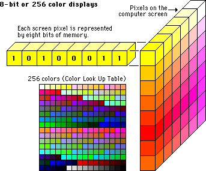

# colors

one of the things that most people think of when they think of gif images \(aside from the fact that they are animated\) its the really awful colors that generally are visible in the form of that pretty iconic "checkered" dithering, this is due to the formats biggest limitation which is the color limit of 8 bit per pixel _per "frame"_, this means that for each given frame in a gif can have a maximum of 256 colors or 255 if one of the bit is reserved for transparency

however if one desires \(mostly for file size purposes\), a gif can use a single unifed palette across every frame with the obvious downside that your entire gif will now be limited to a single table of 255-256 colors and will in almost every case look worse than gifs using per frame palettes












#### 1 bit transparency

unlike the more modern 32 bit color depth \(RGBA for example\), the bit reserved for transparency can only be fully transparent when used, this is why gifs with transparent backgrounds often have extremely jagged edges



#### on dithering

this guide isnt going to cover any dithering methods due to the fact that the tool i use to make gifs uses a different approach to mapping than the "common" way to make gifs, however, **ubitux** wrote a pretty comprehensive review of different dithering techniques and color mapping on [his personal blog ](http://blog.pkh.me/p/21-high-quality-gif-with-ffmpeg.html)which i recommend checking out for additional insight on the topic


  

