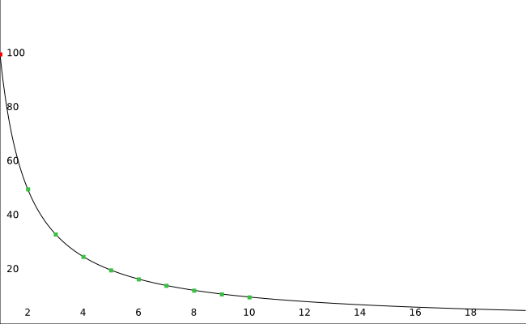
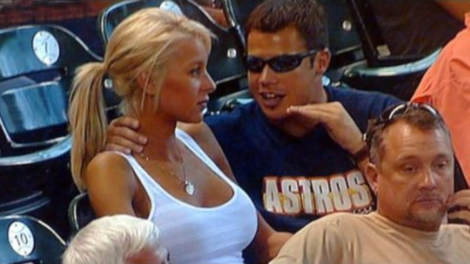

# delay

now heres the technical part most people probably care about, the animation part so heres a simple table showing delays from 1 to 10 and their corresponding framerate for reference



| delay, in n/100th of a second | framerate, in frames/second |
| :--- | :--- |
| _1_ | _100.0_ |
| 2 | 50.0 |
| 3 | 33.3 |
| 4 | 25.0 |
| 5 | 20.0 |
| 6 | 16.7 |
| 7 | 14.3 |
| 8 | 12.5 |
| 9 | 11.1 |
| 10 | 10.0 |
| 100 | 1.0 |

framerates are rounded up to the first closest decimal place







now you may be wondering "ellie where is 60 fps?" or "why is 1/100th italicised?" and youve just fallen into my trap

> see, as definied in the [spec](https://www.w3.org/Graphics/GIF/spec-gif89a.txt), gifs work in hundredths of a second, the smallest possible value \(integers only\) being 1 which translates to displaying the frame for 1/100th of a second, while this value is in the spec, you generally dont want to use it as many browsers and software simply do not support it and will "correct" values specified as 1 to 2 or even 10 in some cases which is a very perceptible difference in timing and will completely throw off your animation thats why you really dont want to use anything besides 2~10

ok, meme aside the reason why 60 fps are not really a thing in practice is due to the fact that 100 cannot be divided by an integer to something that equate 60, in that case i would just tell people to use 2/100th which equates to 50fps and is usually plenty enough however for the purpose of this guide we are going to assume you are really stubborn and really want to make a 60fps gif

well, bad news, thats still not doable mathematically speaking because of the aforementioned reasons but this gives me an opportunity to highlight the used of **mixed delays**


the cool thing about gifs is that much like colors as explained in the previous page, each frame in a gif is either relying on a global palette or on its own palette and this also applies to delays, each frame can either be dependent on a globally set delay or have its own delay which lets us get a lot more creative with our framerate, using that feature one can easily make animations with minimal size by setting a higher delay on a specific frame to hold it in place instead of duplicating it multiple times, however this guide is more centered around going from video to gif so i wont go in details about that


the way **mixed delays** work as the name indicate is by interlacing together 2 \(or more but usually just 2\) different delays to attain a framerate that is as close as possible to the target framerate, usually the process consist on finding what i call a "key" delay which is the one you want to use for most of the frames and a "compensation" delay which is a delay you want to use punctually at a constant rate across the gif to reach the desired framrate over a set amount of frames

what i just explained might seem complicated but it actually isnt so lets go back to our 60 fps and try to craft it using what i just explained

our goal is 60 frames per second so we first start by doing `100/60` which gives us exactly `5/3` or approximately `1.7` which isnt great since i mentionned previously that delays can only be integers, this is where mixing comes into place, for this part keeping your results in fractions will make the process way easier working with decimals will just make everything harder

to attain your desired framerate what you want to do is cancel out the numerator using a number of integers equal to your denominator, in my example the numerator is 5 and the denominator is 3, this means the integers we need to find roughly equal to this pseudo-formula

$$
a*(denominator-1)+b=numerator
$$

while this might seem pretty abstract its actually pretty simple and you might have already figured out what numbers are but ill go over it and plug the  numbers we have above

$$
a*(3-1)+b=5
$$

now its pretty obvious what those integers are supposed to be but ill still put the answer for the sake of clarity

$$
2*(2)+1=5
$$

which gives us a key delay `(a)` of 2 and a compensation delay `(b)` of 1 however if you read everything up to here properly then you already understood why this is not something desirable since i mentionned that delays of 1 are considered an edge case and shouldnt be used at all to avoid any issues

now you may wonder if you have to do that manually for every gif with a timing that isnt in the table above and luckily for you every modern software is intelligent enough that itll do all of what i said above for you, the reason i wanted to explain it "manually" is because i often see people claiming that they have a gif @ 60 fps or higher


you may have likely heard about the trivia regarding spiderman into the spiderverse and how miles is animated at "12 fps" while peter is animated at "24 fps" while not factually incorrect this is pretty confusing to most people because it gives the wrong idea that the overall framerate itself is dependent on the content which is not the case

"fps" as the name indicates means that its over a **specified amount of time** 

because your gif goes really fast does not actually mean that it can go above 50fps, its simply that it likely has less frames than another gif and thus the transitions seem much faster to your eye but the actual amount of frames you will see over one second will be the exact same, the thing that will change is the amount of time you see the same frame over that given period


